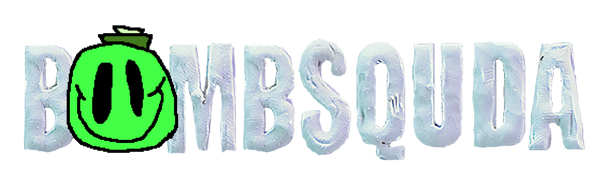
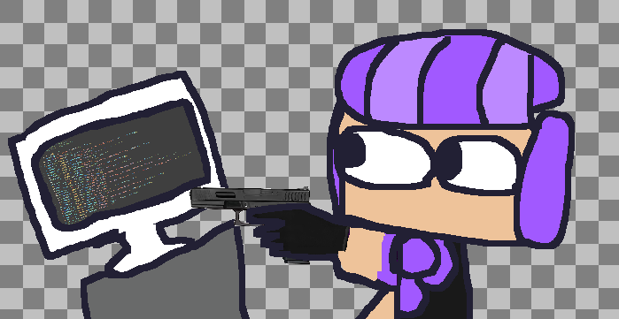

# BombSquda

    <picture>
        
    </picture>

The repository for BombSquda, a stupid modpack for BombSquad. 
This repository was made primarily to allow anyone to edit the code.

## What the fuuuhhh is BombSquda bro???

    <picture>
        
    </picture>

BombSquda (formerly known as BombSquda; Mell's stupid Modpack) 
is a modpack for BombSquad that adds a lot of changes to vanilla 
assets and gameplay, adds ~3 new powerups, 
buncha gameplay mechanics, a LOT of randomization, 
and 1 (yes, ONE) new coop level.

### So how can I help develop... and.. stuff???

    <picture>
        
    </picture>

Download [Github Desktop](https://desktop.github.com/download/), 
clone the repository, make changes to some files, commit and push your changes, then make a pull request. If everything looks fine, i'll accept the merge. :)
